# LokSarthi - Platform Workflow

This document outlines the end-to-end workflow of the LokSarthi platform, detailing both the **User Experience (Frontend Flow)** and the **System Architecture (Backend Flow)**.

## High-Level Architecture Flow

```mermaid
graph TD
    %% Styling
    classDef user fill:#e1f5fe,stroke:#0288d1,stroke-width:2px;
    classDef frontend fill:#fce4ec,stroke:#c2185b,stroke-width:2px;
    classDef aws fill:#fff3e0,stroke:#f57c00,stroke-width:2px;
    classDef ai fill:#f3e5f5,stroke:#7b1fa2,stroke-width:2px;
    classDef db fill:#e8f5e9,stroke:#388e3c,stroke-width:2px;

    %% User Layer
    U(["👤 Citizen (User)"]):::user
    
    %% Frontend Layer
    A1["🎤 Voice Input (Native Lang)"]:::frontend
    A2["⌨️ Text Input (Any Lang)"]:::frontend
    
    %% AWS Edge
    B{"🌐 API Gateway"}:::aws
    
    %% Backend Compute
    C["⚡ AWS Lambda (FastAPI)"]:::aws
    
    %% State Management
    D[("💾 DynamoDB (Sessions & Context)")]:::db
    
    %% Language Services
    E1["🗣️ Amazon Translate / Comprehend"]:::aws
    E2["🔊 Amazon Polly (TTS)"]:::aws
    
    %% AI Brain (Bedrock)
    F{"🧠 AI Orchestrator (Claude 3 Haiku)"}:::ai
    
    %% Service Pillars
    G1["🏛️ Scheme Matcher (40+ Govt Schemes)"]:::ai
    G2["📝 RTI Assistant (Formal English Drafts)"]:::ai
    G3["💰 Financial Advisor (Scam/EMI Calc)"]:::ai
    
    %% Flow Connections
    U -- "Speaks/Types" --> A1 & A2
    A1 & A2 -- "JSON Payload" --> B
    B --> C
    
    C -- "1. Load History" --> D
    C -- "2. Detect/Translate Lang" --> E1
    E1 --> C
    
    C -- "3. Intent Detection" --> F
    F -- "Routing (Categorize Request)" --> G1 & G2 & G3
    
    G1 & G2 & G3 -- "Execute Service Logic & Gen Response" --> F
    F -- "Stream Response" --> C
    
    C -- "4. Save Context" --> D
    C -- "5. Generate Audio" --> E2
    
    E2 -- "MP3 + Text" --> C
    C -- "JSON Response" --> B
    B -- "Display UI & Play Audio" --> U
```

---

## 1. User Experience (Frontend Flow)

The frontend is designed to be highly accessible, voice-first, and zero-literacy friendly.

### Step 1: Landing & Language Selection
*   **Action:** The user visits the LokSarthi website.
*   **Experience:** They are greeted with a clean, dark-themed (India tricolor accented) interface. 
*   **Language Choice:** The user can select their preferred language from a dropdown (10+ Indian languages available).
*   **Immediate Value:** Three clear service cards are presented, instantly explaining what the platform does:
    1.  **Government Schemes** (सरकारी योजनाएँ)
    2.  **RTI / Complaint** (RTI / शिकायत)
    3.  **Financial Advice** (लोन / पैसा सलाह)

### Step 2: Interaction Initiation (Voice or Text)
*   **Action:** The user decides to interact.
*   **Voice (Primary):** The user taps the large, central, pulsing microphone button and speaks their query in their chosen language.
*   **Text (Secondary):** Alternatively, they can tap a service card or type in the chat input bar at the bottom.

### Step 3: Conversational Experience
*   **Action:** The chat interface opens.
*   **Experience:** The user sees their message and immediately receives a response from the "LokSarthi" AI assistant.
*   **Audio Playback:** If the user used voice, or if the Assistant's response is short, the response is automatically spoken back to the user via Text-to-Speech (TTS), ensuring true accessibility.
*   **Flowing Conversation:** The AI asks targeted, conversational follow-up questions to understand the user's specific needs without overwhelming them with long forms.

---

## 2. Core Service Workflows

Depending on the user's intent, the AI routes them through one of three specific pillars:

### Pillar A: Government Scheme Discovery
1.  **Intent Detection:** User says "I need help with farming" or "Any schemes for widows?"
2.  **Progressive Profiling:** The AI asks simple, step-by-step questions to build the `CitizenProfile` (e.g., "What is your age?", "Which state do you live in?"). It stops asking once enough data is gathered.
3.  **Matching Engine:** The backend `scheme_matcher` checks the profile against 40+ curated scheme rules.
4.  **Result Generation:** The AI selects the top matching schemes and uses Amazon Bedrock to generate a simple, 5th-grade level explanation in the user's language, telling them exactly what they get and how to apply.

### Pillar B: RTI & Grievance Filing
1.  **Intent Detection:** User complains about a delayed ration card or broken road.
2.  **Classification:** The AI classifies the issue into one of 8 categories (e.g., "water_supply", "pension_delay").
3.  **Drafting:** The `rti_assistant` takes the plain-language complaint and uses AI to draft a formal, legally structured Right to Information (RTI) application in English.
4.  **Delivery:** The user receives the polite explanation in their language, followed by the formal English RTI draft and step-by-step instructions on how to submit it (online or offline) and the ₹10 fee requirement.

### Pillar C: Financial Literacy & Protection
1.  **Intent Detection:** User asks about a loan or mentions someone calling them for KYC.
2.  **Scam Detection:** The `financial_advisor` checks the input against known scam patterns (Advance Fee, OTP sharing, Lottery). If matched, it immediately issues a high-priority 🚨 warning.
3.  **Predatory Rate Check:** If the user mentions loan interest rates, the system calculates the EMI and flags predatory rates (>36% annual).
4.  **Alternatives:** The AI advises against private 'sahukars' (moneylenders) and suggests safer, cheaper government alternatives like PM SVANidhi or MUDRA loans.

---

## 3. System Architecture (Backend Flow)

Behind the scenes, the workflow maps to a serverless AWS infrastructure.

### The Request Lifecycle
1.  **Frontend Input:** User speaks -> Web Audio API captures audio -> converted to Base64 -> sent to `/api/voice` (or text to `/api/chat`).
2.  **API Gateway:** Routes the request to the main AWS Lambda function.
3.  **Session Management (DynamoDB):** The Lambda function retrieves the active `Session` from DynamoDB using the `session_id`, rebuilding the conversation context.
4.  **Language Services:**
    *   *(If Voice)* **Amazon Transcribe** (Future) converts audio to text.
    *   **Amazon Comprehend** detects the language.
    *   **Amazon Translate** converts non-Hindi/English text to a baseline language for the LLM if needed.
5.  **Orchestrator (The Brain):**
    *   Calls **Amazon Bedrock (Claude 3 Haiku)** to detect the `intent` and extract updated profile entities.
    *   Routes data to the appropriate service module (`scheme_matcher`, `rti_assistant`, `financial_advisor`).
6.  **AI Response Generation:** The specific service calls Bedrock again with a tightly scoped system prompt and contextual data (e.g., JSON schemes database) to generate a helpful, accurate response.
7.  **Text-to-Speech:** If the response is concise, **Amazon Polly** converts the text back into an audio MP3.
8.  **Output:** Lambda saves the updated session to DynamoDB and returns the text and audio Base64 back to the frontend to be displayed and played.
